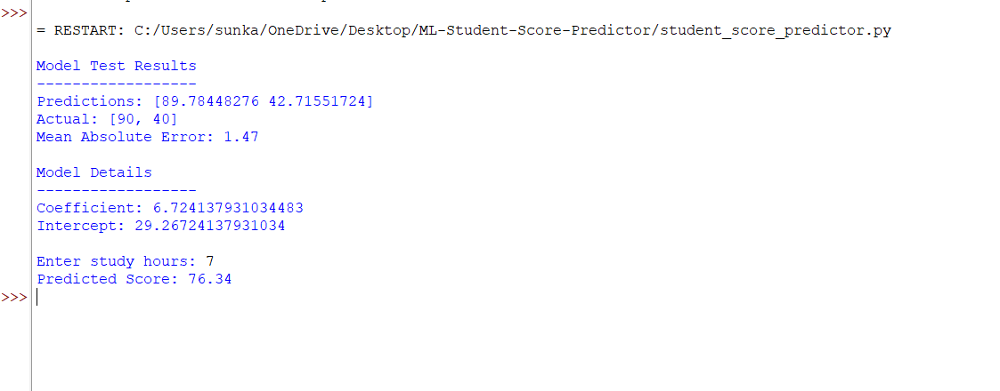

# Student Score Predictor (Machine Learning Project)

## Overview
This project predicts student exam scores based on number of study hours using a Linear Regression Machine Learning model.

## Objective
To demonstrate basic Machine Learning workflow including:
- Dataset creation
- Training model
- Testing model
- Evaluating performance
- Predicting user input

## Technologies Used
- Python
- Pandas
- Scikit-learn

## Dataset
Sample dataset created manually for demonstration:

Hours Studied → Exam Score

## Model Used
Linear Regression

## Evaluation Metric
Mean Absolute Error (MAE)

## How To Run
Install dependencies:
pip install pandas scikit-learn

Run program:
python student_score_predictor.py

## Example Output
Model predicts expected exam score based on study hours input.

## Learning Outcome
This project demonstrates understanding of:
- Supervised Learning
- Model training & testing
- Error evaluation
- Data preprocessing

## Project Output

## Project Structure
├── student_score_predictor.py  
├── requirements.txt  
├── output.png  
└── README.md  

## Future Improvements
- Add web interface
- Use multiple regression
- Deploy model online

## Author
SUNKARA PARDHASARADHI
